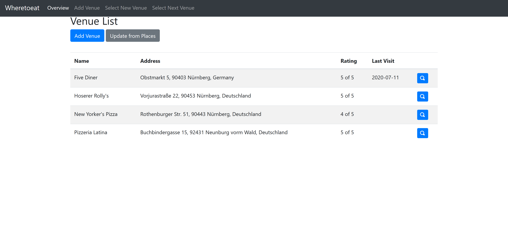

# wheretoeat

Wanna go eat but dont know where? Let where to eat handle that

## Setup

Simply download the zip file and fire up the executable.

If you want to make use of the Google Places API you have to add your own key.

Attention: If you want to host this online make sure to protected it by htaccess or similar means.

## Screenshot

